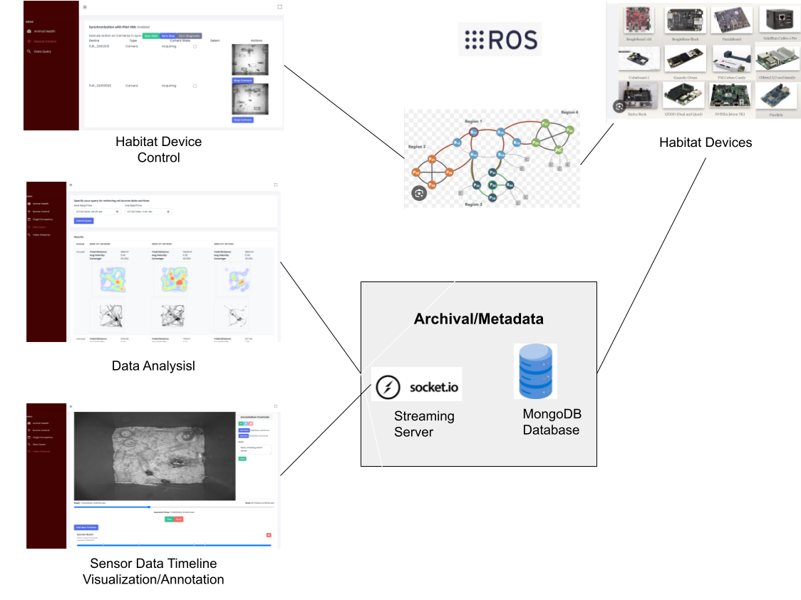

# About

```markdown
- Description: This repository contains all React front end code, including instructions on setup and best practices.  The frontend is a GUI that can be used as a dashboard for controlling your experiment, viewing status on embedded sensors or actuators in your system, and effectively retrieving data collected during the experiment.
- Version: 0.8.0
- Release Date: 
- Creation Date: 2023-11-19
- License: BSD-3-Clause
- Author: David Schauder
- Email: schauderd@janelia.hhmi.org
- Copyright: 2023 Howard Hughes Medical Institute
```

## Overview

The Habitat GUI is the main visual interface for controlling your Habitat Behavioral setup.  It runs as a web application and connects over ROS2 on your local network to do introspection on your Habitat nodes.  It contains a Dashboard with separate pages for controlling your experiment, viewing status on embedded sensors/actuators in your system, and data visualizers for reviewing and annotating your sensor data.  It uses a bridge technology called [ROSBridge ](https://wiki.ros.org/rosbridge_suite)! to connect to the Habitat ROS communication hub.  It also connects to the database through a Mongoose File Server to retrieve videos and data.
    
## Installation
You will need node and npm installed in order to run the webserver.  You can set up Node by following these [instructions](https://docs.npmjs.com/downloading-and-installing-node-js-and-npm).  Once Node/NPM is set up, there are 3 necessary components to set up the Frontend. 

   - Habitat REST server - used by the GUI for HabitatDb access.  Runs as a Node Express server.  Should run on the same box as the GUI.  Runs by default on port 5001. To start the REST server, navigate to the FileServer folder and run the following.
    ```
      npm install
      npm start
    ```
    - Habitat Dashboard -  Provides a dashboard for managing animal health, providing control of cameras, sensors, and embedded control nodes.  Also provides a convenient front-end for retrieving experiment data. To install the dependencies for the Frontend, navigate to the Dashboard folder and run the following.
    ```
      npm install
      npm start
    ```

    - ROSBridge - <Need Instructions for setup, installation and configuration>

## Dashboard User Guide
This is a quick overview of the different pages available through the front end.  Please reference the documentation for the 
### Device Control
   - This page listens for Habitat nodes on the local network.  Whenever it hears a heartbeat status message from one of the local Habitat nodes, it will "discover" that node and display status and control information.
### Data Analyis
   - This page has some canned queries for generating statistics and heatmaps based off time ranges in the experiments.
### Data Visualization/Annotation
   - This page provides timeline visualization of all rigs and datasets that your behavioral sensors have generated.  It also allows you to create corresponding annotation timelines for each  
   
